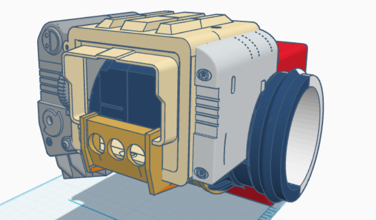
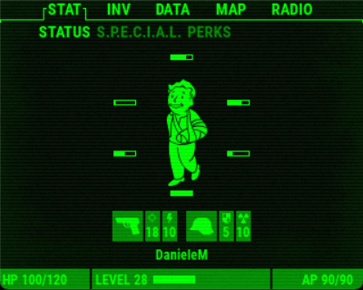
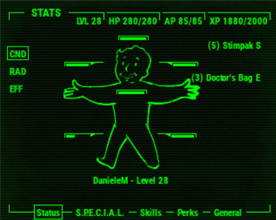

# Survival-PC-3000 
An open-source post-apocalyptic forearm PC inspired by the Pip-Boy from Fallout New Vegas.

## Features
- **Radiation Monitoring:** Built-In Geiger counter to detect gamma and beta radiations so you know where you should NOT go
- **Audio:** Integrated Mini-Speaker and Radio Module to feel the Nuclear Vibes
- **Clock:** The Real Time Clock (RTC) Module will wake you up always at the right time. As they say "The early bird gets the Radroach"
- **Reinforced structure:** M2 and M3 screws with some glue and neodimium magnets will make this Pip-Boy indestructable
- **Compatibility:** with a Usb-c port for charging, a Usb port for inputs (ex: Mouse or Keyboard), and a HDMI integrated cable for screen mirroring, you can always connect with older and newer technologies alike
## Hardware & Bill of materials
You can find the detailed cost breakdown, component list and buying links in my [BOM.md](./BOM.md) and [BOM.csv](./BOM.csv) files.
## Software
The device runs a **Raspberry Pi OS (Legacy 32-bit with Desktop)** on a Raspberry Pi Zero 2W and it uses some custom python scripts to interface with sensors, a touch screen and physical inputs (that stay true to the original model ). The python scripts are built so as to remulate the Pip-boy Operating Systems from the games Fallout 4 and Fallout New Vegas; the Pip-Boy OS that you can find in the repo can also be personalized using the Configure.py that you can find in the [Pip-boy OS file](Software /Pip-Boy OS). To start the code you need to run [main.py]() in Python

## Important Information
1) Some parts of the project are not mine, I took some scripts and 3D models online, in order to make my project as similar as possible to the  model that inspired it. All the elements I took online are listed in the [BOM.md](./BOM.md) file.
2) I'll release the code in this repo when I'll complete a semi-complete PC version
3) The Solar Panel Add-on will NOT be implemented in the survival-pc 3000 for the stardance shipping (becase I'm lacking the time to make the 3D model for a support), **Hack Club you can remove the solar panel from the total price or you can keep it**, I don't mind, however after stardance I'll work on implementing said add-on and maybe something more ;)
